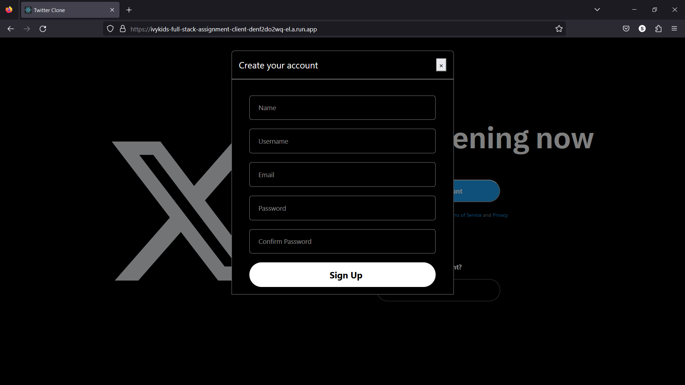
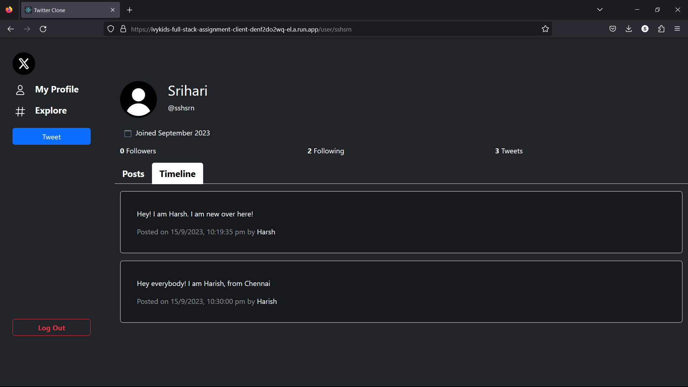

# Ivykids-Full Stack Assignment

This repository contains a mini twitter clone built in MERN stack(MongoDB, Express.js, React.js, Node.js).

## Deployment Links

- Frontend: https://ivykids-full-stack-assignment-client-denf2do2wq-el.a.run.app/
- Backend: https://ivykids-full-stack-assignment-server-denf2do2wq-uc.a.run.app/

## Task completion checklist:

### Requirements:

- [x] Implement a user registration and authentication system.
- [x] Users should be able to register with a unique username and password.
- [x] Users should be able to log in and log out.
- [x] Implement authentication using JWT (JSON Web Tokens).
- [x] Design and implement the database schema using MongoDB to store user data, tweets and follower information.
- [x] Create and delete tweets.
- [x] Follow/Unfollow any user.
- [x] View the timeline, which displays tweets from followed users in chronological order.

### Brownie Tasks (optional):

- [x] Deploy both the frontend and backend application. (I used **Google Cloud Run** for deployment)
- [x] Use Typescript.
- [ ] Use GraphQL as an API Gateway and interact with GraphQL from the frontend.
- [x] Add image/video upload functionality for image/video in tweets. (I used **Cloudinary**)

## Screenshots

### Home Page

### Sign Up Page

### Login Page

### User Profile Page

### New Tweet

### Tweet with media attachment

### Search Users

### Follow/Unfollow Users

### Timeline

### Logout

